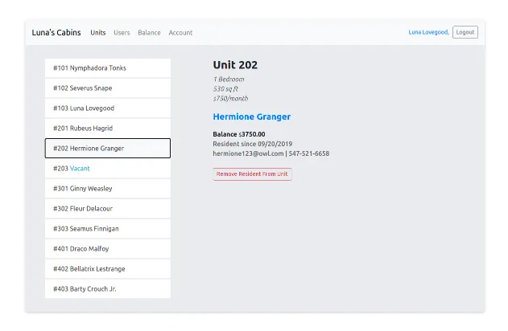

# iManage

iManage is a project I built at Flatiron school for the React and Redux section of the course. Using React and Redux, I wanted to build an application that hypothetically, my apartment manager could use to manage units and tenants in her apartment complex. I also wanted the tenants of the apartment complex to be able to sign in and make payments towards their rent balance.

iManage consists of a React front end (React files are located in /client) and Rails API back end. Other technologies: Client-sided Routing, AJAX, Styling using React Bootstrap and CSS, React class components, custom JSON serializers, and Rails ActiveRecord ORM connected PostgreSQL DB.

Application deployed using Heroku: https://i-manage.herokuapp.com/ 

## Screenshot



## Usage

I ended up seeding the data with characters from Harry Potter. Luna is the apartment manager and has manager access to all the users an units. There is a fixed number of units (12 units) in her apartment complex, "Luna's Cabins". She can create and delete new residents that want to move in to her apartment, and assign them to a unit. Once tenants have been assigned to a unit, the application will start to calculate and display users' balance.

Residents can sign in to their accounts and submit payments. They can also browse their previous payments.

### Manager Access

1. Sign in as Luna: email: itsluna@owl.com, password: nargles
2. Browse tenants and units
3. Create a new resident account
4. Assign user to an empty unit.
5. Delete residencies where users are moving out.

### Resident Access

1. Sign in / Register (Nymphadora: email: nymphaaaa@owl.com, password: icanchange)
2. Manager needs to assign user to a unit
3. Once assigned to a unit, check your balance, and past payment history
4. Submit a new payment

## Cloning and running the application locally:

1. Install Ruby Gems

```bash
$ bundle install
```

2. Install JS node packages (package.json is in /client folder)

```bash
$ cd client
$ npm install
```

3. Migrate and seed database. (Seeding must be executed in that order***)

```bash
$ rails db:migrate
$ rails db:seed:users
$ rails db:seed:units
$ rails db:seed:residencies
$ rails db:seed:payments_1
$ rails db:seed:payments_2
$ rails db:seed:payments_3
$ rails db:seed:payments_4
```

4. Run Rails server and React server using `rake start`

```bash
$ rake start
```

5. Navigate to localhost:3000 in your browser, login to either Luna (manager) or Nymphadora (resident).

```bash
Luna 
email: itsluna@owl.com
password: nargles

Nymphadora
email: nymphaaaa@owl.com
password: icanchange
```

## Feedback 

Thanks for checking out my project. Any feedback is welcomed!
